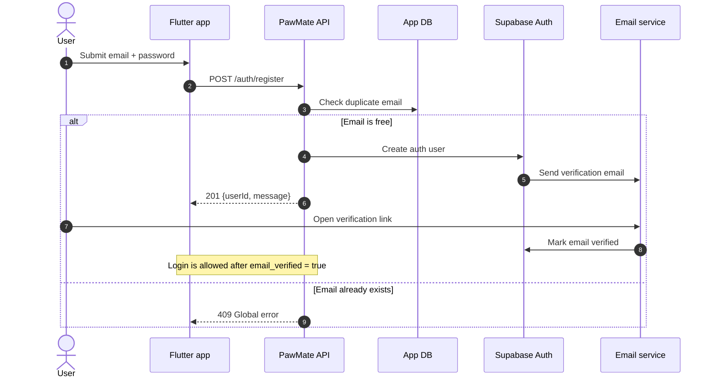
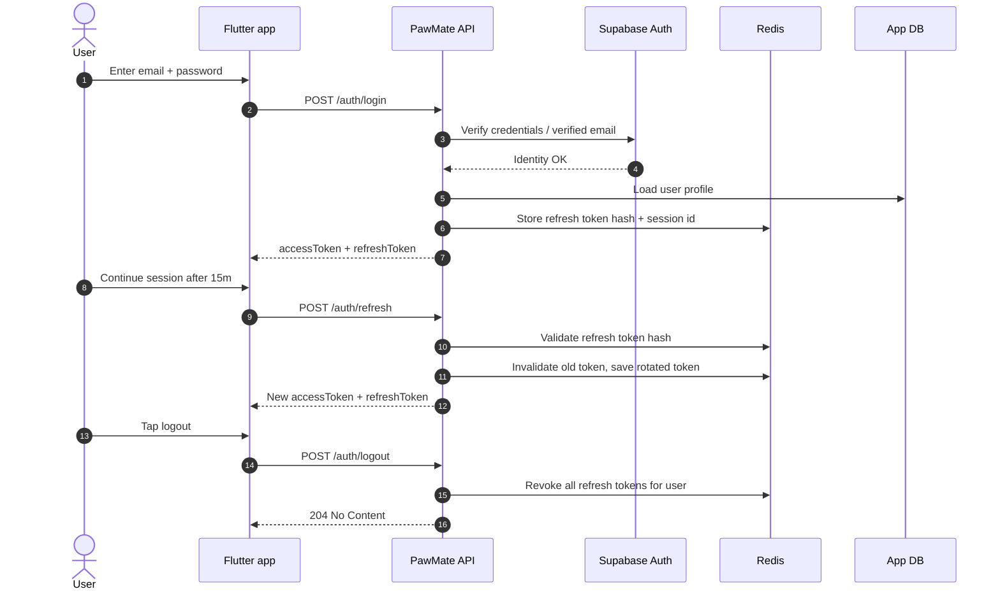
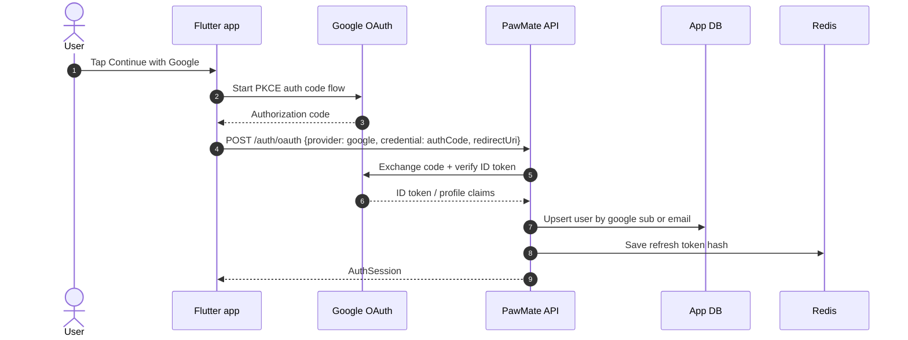
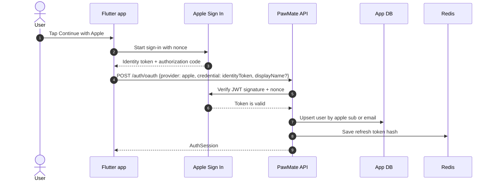

# PawMate Day 2 Auth Sequence Diagrams

Scope: D2-05. These flows assume Supabase handles identity verification and PawMate backend owns the app session boundary.

## 1) Email register + verification

## 2) Login + refresh token rotation

## 3) Google OAuth PKCE

## 4) Apple Sign In

## Notes

- Access tokens are short-lived; refresh tokens are rotated on every refresh.
- Apple name data may only be present on first sign-in.
- The app should not treat Supabase session state as the final API session source.
