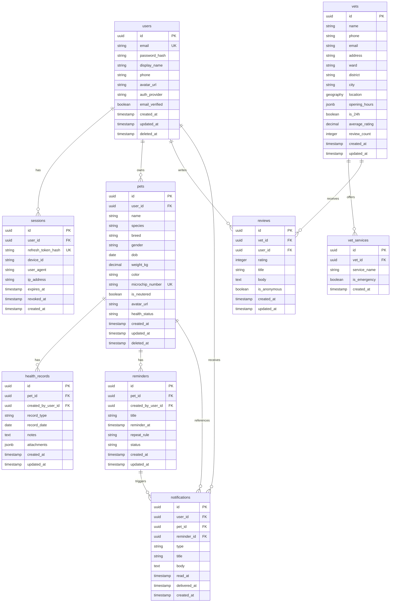

# PawMate Phase 1 ERD

This ERD covers the Day 1 and Phase 1 domain only: auth, pet profile, vet finder, reviews, health records, reminders, and notifications.

## Relationship notes
- A user can own many pets and can create many sessions.
- A pet belongs to exactly one user in Phase 1.
- A clinic can expose many services and receive many reviews.
- A pet can have many health records and many reminders.
- A reminder can generate zero or more notifications over time.
- Notifications are user-scoped, with optional links back to a pet and reminder.

## Key constraints
- `users.email` is unique.
- `sessions.refresh_token_hash` is unique and revocable.
- `pets.microchip_number` is unique when provided.
- `reviews` should enforce one active review per user per vet if product rules require it.
- `vets.location` should use `geography(Point, 4326)` or equivalent PostGIS support.

## Index plan
- `users(email)`
- `sessions(user_id, revoked_at)`
- `pets(user_id, deleted_at)`
- `vets USING GIST(location)`
- `vets(is_24h, average_rating)`
- `vet_services(vet_id, service_name)`
- `reviews(vet_id, created_at desc)`
- `reviews(user_id)`
- `health_records(pet_id, record_date desc)`
- `reminders(pet_id, reminder_at)`
- `notifications(user_id, read_at, created_at desc)`

## Phase 1 scope guard
- Public profiles, marketplace, rescue, adoption, payments, and AI features are out of scope.
- Reminder delivery can be documented now even if the worker implementation lands later.
- Review analytics beyond basic counts and averages are deferred.
